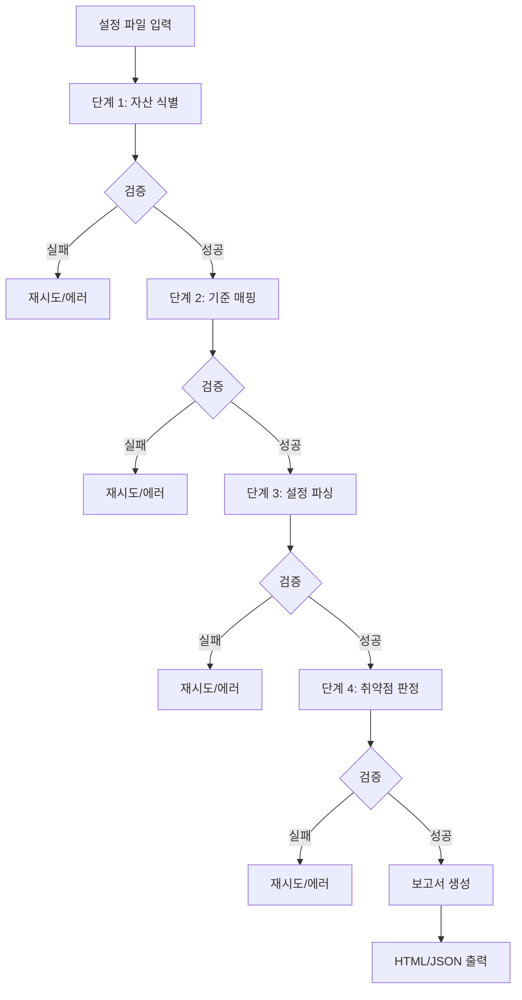
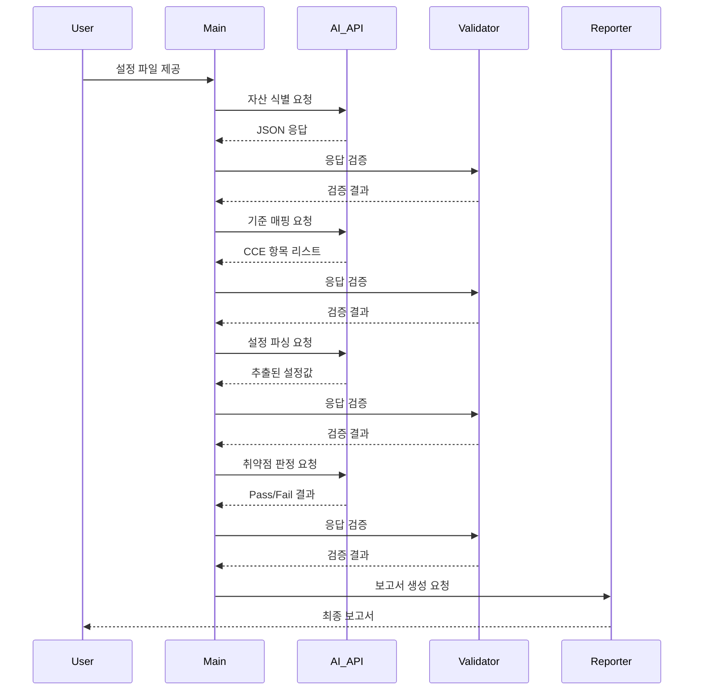

# 네트워크 장비 CCE 진단 도구 설계 명세서

## 1. 프로젝트 개요

### 목적
AI를 활용하여 네트워크 장비의 설정 파일을 분석하고 CCE(Common Configuration Enumeration) 기준에 따라 보안 점검을 자동화하는 도구

### 기술 스택
- Python 3.9+
- AI API (OpenAI GPT-4 / Anthropic Claude) 또는 로컬 LLM (Llama)
- JSON 기반 데이터 교환

### 핵심 설계 원칙
1. **단계별 AI 호출 분리**: 각 단계는 독립적으로 검증 가능
2. **구조화된 입출력**: 모든 AI 응답은 JSON 형식
3. **검증 로직 내장**: 각 단계마다 AI 응답의 유효성 검사
4. **추적 가능성**: 각 단계의 결과를 로깅하여 디버깅 용이

---

## 2. 시스템 아키텍처

### 전체 흐름도



### 데이터 흐름



---

## 3. 각 단계 상세 명세

### 단계 1: 자산 식별 (Asset Identification)

**목적**: 설정 파일에서 장비 타입, OS 버전, 역할을 식별

**입력 데이터**:
```python
{
    "config_text": "전체 설정 파일 내용 (최대 4000자)",
    "filename": "router_config.txt"
}
```

**AI 프롬프트 템플릿**:
```
당신은 네트워크 보안 전문가입니다. 제공된 네트워크 장비 설정 파일을 분석하여 다음 정보를 추출하세요.

**중요**: 반드시 아래 JSON 형식으로만 응답하세요. 추가 설명이나 마크다운 코드블록 없이 순수 JSON만 출력하세요.

설정 파일:
```
{config_text}
```

출력 형식:
{{
  "device_vendor": "제조사 (예: Cisco, Juniper, Huawei)",
  "device_model": "모델명 (예: Catalyst 3850, ASA 5506)",
  "os_type": "운영체제 (예: IOS, IOS-XE, JunOS, NX-OS)",
  "os_version": "버전 (예: 15.2(4)E7)",
  "device_role": "역할 (예: core_switch, edge_router, firewall)",
  "hostname": "호스트명",
  "confidence": 0.0-1.0 사이 신뢰도 점수
}}
```

**출력 데이터 스키마**:
```json
{
  "device_vendor": "string",
  "device_model": "string",
  "os_type": "string",
  "os_version": "string",
  "device_role": "string",
  "hostname": "string",
  "confidence": "float"
}
```

**검증 로직**:
```python
def validate_asset_identification(response: dict, config_text: str) -> tuple[bool, str]:
    """
    자산 식별 응답 검증
    
    Returns:
        (is_valid, error_message)
    """
    required_fields = ["device_vendor", "device_model", "os_type", "os_version", "device_role", "confidence"]
    
    # 필수 필드 체크
    for field in required_fields:
        if field not in response:
            return False, f"필수 필드 누락: {field}"
    
    # 신뢰도 범위 체크
    if not (0 <= response["confidence"] <= 1):
        return False, f"잘못된 신뢰도 값: {response['confidence']}"
    
    # 휴리스틱 검증: 설정 파일과 응답의 일관성
    config_lower = config_text.lower()
    vendor_lower = response["device_vendor"].lower()
    
    # Cisco 장비인데 Cisco가 아니라고 판단한 경우
    if "cisco" in config_lower and "cisco" not in vendor_lower:
        return False, "장비 제조사 불일치 (설정에 Cisco 포함)"
    
    # 버전 정보가 있는지 확인
    if not response["os_version"] or response["os_version"] == "unknown":
        return False, "OS 버전 정보 없음"
    
    return True, "OK"
```

---

### 단계 2: 기준 매핑 (Compliance Criteria Mapping)

**목적**: 식별된 자산 타입에 맞는 CCE 점검 항목 선택

**입력 데이터**:
```python
{
    "asset_info": {단계1의 출력 결과},
    "compliance_standard": "CCE"  # 나중에 CIS, DISA STIG 추가 가능
}
```

**AI 프롬프트 템플릿**:
```
당신은 네트워크 보안 점검 전문가입니다. 다음 네트워크 자산에 적용할 CCE(Common Configuration Enumeration) 점검 항목을 선택하세요.

자산 정보:
{asset_info}

**중요**: 반드시 아래 JSON 형식으로만 응답하세요.

다음 보안 영역에서 각각 중요한 점검 항목을 선택하세요:
1. 인증/접근제어 (Authentication)
2. 암호화 (Encryption)
3. 로깅/감사 (Logging)
4. 네트워크 보안 (Network Security)
5. 관리 인터페이스 (Management)

출력 형식:
{{
  "checks": [
    {{
      "check_id": "CCE-001",
      "category": "authentication|encryption|logging|network|management",
      "title": "점검 항목 제목",
      "description": "점검 내용 설명",
      "severity": "critical|high|medium|low",
      "check_command": "설정에서 찾을 명령어나 패턴",
      "expected_pattern": "정규식 또는 예상 값",
      "compliant_example": "정상 설정 예시",
      "non_compliant_example": "취약 설정 예시"
    }}
  ]
}}

최소 10개 이상의 점검 항목을 포함하세요.
```

**출력 데이터 스키마**:
```json
{
  "checks": [
    {
      "check_id": "string",
      "category": "string",
      "title": "string",
      "description": "string",
      "severity": "string",
      "check_command": "string",
      "expected_pattern": "string",
      "compliant_example": "string",
      "non_compliant_example": "string"
    }
  ]
}
```

**검증 로직**:
```python
def validate_criteria_mapping(response: dict, asset_info: dict) -> tuple[bool, str]:
    """
    기준 매핑 응답 검증
    """
    if "checks" not in response:
        return False, "checks 필드 없음"
    
    checks = response["checks"]
    
    if len(checks) < 10:
        return False, f"점검 항목 부족: {len(checks)}개 (최소 10개 필요)"
    
    required_check_fields = [
        "check_id", "category", "title", "description", 
        "severity", "check_command", "expected_pattern"
    ]
    
    valid_categories = ["authentication", "encryption", "logging", "network", "management"]
    valid_severities = ["critical", "high", "medium", "low"]
    
    for idx, check in enumerate(checks):
        # 필수 필드 체크
        for field in required_check_fields:
            if field not in check:
                return False, f"점검 항목 {idx}: {field} 필드 누락"
        
        # category 유효성
        if check["category"] not in valid_categories:
            return False, f"점검 항목 {idx}: 잘못된 category '{check['category']}'"
        
        # severity 유효성
        if check["severity"] not in valid_severities:
            return False, f"점검 항목 {idx}: 잘못된 severity '{check['severity']}'"
        
        # check_id 중복 체크
        check_ids = [c["check_id"] for c in checks]
        if len(check_ids) != len(set(check_ids)):
            return False, "중복된 check_id 발견"
    
    return True, "OK"
```

---

### 단계 3: 설정 파싱 (Configuration Parsing)

**목적**: 각 점검 항목에 해당하는 실제 설정값 추출

**입력 데이터**:
```python
{
    "config_text": "전체 설정 파일",
    "checks": [단계2의 checks 배열]
}
```

**AI 프롬프트 템플릿**:
```
당신은 네트워크 설정 파싱 전문가입니다. 제공된 설정 파일에서 각 점검 항목에 해당하는 설정값을 추출하세요.

설정 파일:
```
{config_text}
```

점검 항목:
{checks}

**중요**: 반드시 아래 JSON 형식으로만 응답하세요.

각 점검 항목에 대해:
1. check_command로 지정된 설정을 찾으세요
2. 해당 설정의 실제 값을 추출하세요
3. 설정이 없으면 "NOT_FOUND"로 표시하세요

출력 형식:
{{
  "parsed_configs": [
    {{
      "check_id": "CCE-001",
      "found": true|false,
      "actual_config": "실제 설정 내용 (최대 500자)",
      "config_lines": ["관련 설정 라인들"],
      "line_numbers": [설정이 위치한 라인 번호들]
    }}
  ]
}}
```

**출력 데이터 스키마**:
```json
{
  "parsed_configs": [
    {
      "check_id": "string",
      "found": "boolean",
      "actual_config": "string",
      "config_lines": ["array of strings"],
      "line_numbers": ["array of integers"]
    }
  ]
}
```

**검증 로직**:
```python
def validate_config_parsing(response: dict, checks: list) -> tuple[bool, str]:
    """
    설정 파싱 응답 검증
    """
    if "parsed_configs" not in response:
        return False, "parsed_configs 필드 없음"
    
    parsed_configs = response["parsed_configs"]
    
    # 모든 점검 항목에 대한 파싱 결과가 있는지 확인
    check_ids = {check["check_id"] for check in checks}
    parsed_ids = {pc["check_id"] for pc in parsed_configs}
    
    if check_ids != parsed_ids:
        missing = check_ids - parsed_ids
        return False, f"누락된 점검 항목: {missing}"
    
    required_fields = ["check_id", "found", "actual_config"]
    
    for pc in parsed_configs:
        for field in required_fields:
            if field not in pc:
                return False, f"{pc.get('check_id', 'unknown')}: {field} 필드 누락"
        
        # found가 True인데 actual_config가 비어있으면 안됨
        if pc["found"] and not pc["actual_config"]:
            return False, f"{pc['check_id']}: found=True인데 actual_config 비어있음"
    
    return True, "OK"
```

---

### 단계 4: 취약점 판정 (Vulnerability Assessment)

**목적**: 실제 설정값과 기준을 비교하여 Pass/Fail 판정

**입력 데이터**:
```python
{
    "checks": [단계2의 checks 배열],
    "parsed_configs": [단계3의 parsed_configs 배열]
}
```

**AI 프롬프트 템플릿**:
```
당신은 네트워크 보안 감사 전문가입니다. 각 점검 항목에 대해 실제 설정이 기준을 만족하는지 판정하세요.

점검 기준과 실제 설정:
{combined_data}

**중요**: 반드시 아래 JSON 형식으로만 응답하세요.

각 점검 항목에 대해:
1. expected_pattern과 actual_config를 비교
2. compliant_example과 non_compliant_example을 참고
3. Pass 또는 Fail 판정
4. 판정 이유를 명확히 설명

출력 형식:
{{
  "assessment_results": [
    {{
      "check_id": "CCE-001",
      "status": "PASS|FAIL|NOT_APPLICABLE|ERROR",
      "risk_level": "critical|high|medium|low|info",
      "finding": "취약점 발견 시 상세 설명, Pass 시 'Compliant'",
      "evidence": "판정 근거가 된 실제 설정",
      "recommendation": "Fail 시 수정 권고사항",
      "cve_reference": "관련 CVE가 있다면 나열 (선택사항)"
    }}
  ],
  "summary": {{
    "total_checks": 0,
    "passed": 0,
    "failed": 0,
    "not_applicable": 0,
    "critical_findings": 0,
    "high_findings": 0,
    "compliance_score": 0.0
  }}
}}

판정 기준:
- PASS: 기준을 만족하는 설정
- FAIL: 기준을 만족하지 않는 취약한 설정
- NOT_APPLICABLE: 해당 장비/환경에 적용 불가
- ERROR: 설정을 찾을 수 없거나 판정 불가
```

**출력 데이터 스키마**:
```json
{
  "assessment_results": [
    {
      "check_id": "string",
      "status": "string",
      "risk_level": "string",
      "finding": "string",
      "evidence": "string",
      "recommendation": "string",
      "cve_reference": "string (optional)"
    }
  ],
  "summary": {
    "total_checks": "integer",
    "passed": "integer",
    "failed": "integer",
    "not_applicable": "integer",
    "critical_findings": "integer",
    "high_findings": "integer",
    "compliance_score": "float"
  }
}
```

**검증 로직**:
```python
def validate_vulnerability_assessment(response: dict, checks: list) -> tuple[bool, str]:
    """
    취약점 판정 응답 검증
    """
    if "assessment_results" not in response or "summary" not in response:
        return False, "assessment_results 또는 summary 필드 없음"
    
    results = response["assessment_results"]
    summary = response["summary"]
    
    # 결과 개수 검증
    if len(results) != len(checks):
        return False, f"결과 개수 불일치: {len(results)} vs {len(checks)}"
    
    valid_statuses = ["PASS", "FAIL", "NOT_APPLICABLE", "ERROR"]
    valid_risk_levels = ["critical", "high", "medium", "low", "info"]
    
    status_counts = {"PASS": 0, "FAIL": 0, "NOT_APPLICABLE": 0, "ERROR": 0}
    
    for result in results:
        # 필수 필드 체크
        required = ["check_id", "status", "risk_level", "finding", "evidence"]
        for field in required:
            if field not in result:
                return False, f"{result.get('check_id', 'unknown')}: {field} 필드 누락"
        
        # status 유효성
        if result["status"] not in valid_statuses:
            return False, f"잘못된 status: {result['status']}"
        
        # risk_level 유효성
        if result["risk_level"] not in valid_risk_levels:
            return False, f"잘못된 risk_level: {result['risk_level']}"
        
        status_counts[result["status"]] += 1
        
        # FAIL인데 recommendation이 없으면 경고
        if result["status"] == "FAIL" and not result.get("recommendation"):
            return False, f"{result['check_id']}: FAIL인데 recommendation 없음"
    
    # summary 검증
    if summary["total_checks"] != len(checks):
        return False, "summary.total_checks 불일치"
    
    if summary["passed"] != status_counts["PASS"]:
        return False, "summary.passed 카운트 불일치"
    
    if summary["failed"] != status_counts["FAIL"]:
        return False, "summary.failed 카운트 불일치"
    
    # compliance_score 범위 체크
    if not (0 <= summary["compliance_score"] <= 100):
        return False, f"잘못된 compliance_score: {summary['compliance_score']}"
    
    return True, "OK"
```

---

## 4. 구현 가이드

### 디렉토리 구조
```
network_cce_checker/
├── main.py                 # 메인 실행 파일
├── config.py               # 설정 관리
├── ai_client.py            # AI API 클라이언트
├── validators.py           # 검증 로직 모음
├── stages/
│   ├── __init__.py
│   ├── asset_identification.py
│   ├── criteria_mapping.py
│   ├── config_parsing.py
│   └── vulnerability_assessment.py
├── utils/
│   ├── __init__.py
│   ├── logger.py
│   └── file_handler.py
├── templates/
│   ├── prompts/            # AI 프롬프트 템플릿
│   └── reports/            # 보고서 HTML 템플릿
├── tests/
│   └── test_*.py
├── data/
│   ├── sample_configs/     # 테스트용 설정 파일
│   └── outputs/            # 결과 출력 디렉토리
├── requirements.txt
└── README.md
```

### 핵심 클래스 설계

```python
# main.py 의사코드
class CCEChecker:
    def __init__(self, ai_client, config):
        self.ai_client = ai_client
        self.config = config
        self.logger = Logger()
        
    def run_assessment(self, config_file_path: str) -> dict:
        """전체 점검 프로세스 실행"""
        
        # 설정 파일 로드
        config_text = self.load_config_file(config_file_path)
        
        # 단계 1: 자산 식별
        asset_info = self.stage_1_asset_identification(config_text)
        self.logger.log_stage(1, asset_info)
        
        # 단계 2: 기준 매핑
        criteria = self.stage_2_criteria_mapping(asset_info)
        self.logger.log_stage(2, criteria)
        
        # 단계 3: 설정 파싱
        parsed_configs = self.stage_3_config_parsing(config_text, criteria)
        self.logger.log_stage(3, parsed_configs)
        
        # 단계 4: 취약점 판정
        assessment = self.stage_4_vulnerability_assessment(criteria, parsed_configs)
        self.logger.log_stage(4, assessment)
        
        # 보고서 생성
        report = self.generate_report(asset_info, assessment)
        
        return report
    
    def stage_1_asset_identification(self, config_text: str) -> dict:
        """단계 1 실행"""
        prompt = self.build_prompt_stage1(config_text)
        
        for attempt in range(3):  # 최대 3번 재시도
            response = self.ai_client.call(prompt)
            
            # JSON 파싱
            try:
                parsed = json.loads(response)
            except json.JSONDecodeError:
                # 마크다운 코드블록 제거 후 재시도
                parsed = self.extract_json_from_markdown(response)
            
            # 검증
            is_valid, error = validate_asset_identification(parsed, config_text)
            
            if is_valid:
                return parsed
            else:
                self.logger.warning(f"검증 실패 (시도 {attempt+1}): {error}")
        
        raise ValidationError("자산 식별 실패: 최대 재시도 횟수 초과")
```

### AI 클라이언트 추상화

```python
# ai_client.py
from abc import ABC, abstractmethod

class AIClient(ABC):
    @abstractmethod
    def call(self, prompt: str, max_tokens: int = 2000) -> str:
        """AI API 호출"""
        pass

class OpenAIClient(AIClient):
    def __init__(self, api_key: str, model: str = "gpt-4-turbo"):
        self.api_key = api_key
        self.model = model
        
    def call(self, prompt: str, max_tokens: int = 2000) -> str:
        # OpenAI API 호출 구현
        pass

class ClaudeClient(AIClient):
    def __init__(self, api_key: str, model: str = "claude-3-5-sonnet-20241022"):
        self.api_key = api_key
        self.model = model
        
    def call(self, prompt: str, max_tokens: int = 2000) -> str:
        # Anthropic API 호출 구현
        pass

class LocalLLMClient(AIClient):
    def __init__(self, model_path: str, api_url: str = "http://localhost:11434"):
        self.model_path = model_path
        self.api_url = api_url  # Ollama 또는 llama.cpp 서버
        
    def call(self, prompt: str, max_tokens: int = 2000) -> str:
        # 로컬 LLM API 호출 구현
        pass
```

---

## 5. 에러 처리 및 로깅

### 에러 처리 전략

```python
class CCECheckerError(Exception):
    """기본 예외 클래스"""
    pass

class ValidationError(CCECheckerError):
    """검증 실패"""
    pass

class AIAPIError(CCECheckerError):
    """AI API 호출 실패"""
    pass

class ConfigFileError(CCECheckerError):
    """설정 파일 로드 실패"""
    pass

# 사용 예시
try:
    result = checker.run_assessment("router.cfg")
except ValidationError as e:
    logger.error(f"검증 오류: {e}")
    # 부분 결과라도 저장
except AIAPIError as e:
    logger.error(f"AI API 오류: {e}")
    # 재시도 또는 폴백
except Exception as e:
    logger.critical(f"예상치 못한 오류: {e}")
```

### 로깅 전략

```python
# utils/logger.py
import logging
import json
from datetime import datetime

class AssessmentLogger:
    def __init__(self, output_dir: str):
        self.output_dir = output_dir
        self.session_id = datetime.now().strftime("%Y%m%d_%H%M%S")
        
        # 파일 핸들러 설정
        logging.basicConfig(
            level=logging.INFO,
            format='%(asctime)s - %(levelname)s - %(message)s',
            handlers=[
                logging.FileHandler(f"{output_dir}/assessment_{self.session_id}.log"),
                logging.StreamHandler()
            ]
        )
        self.logger = logging.getLogger(__name__)
        
    def log_stage(self, stage_num: int, data: dict):
        """각 단계 결과 로깅"""
        stage_file = f"{self.output_dir}/stage{stage_num}_{self.session_id}.json"
        
        with open(stage_file, 'w', encoding='utf-8') as f:
            json.dump(data, f, ensure_ascii=False, indent=2)
        
        self.logger.info(f"단계 {stage_num} 완료: {stage_file}")
```

---

## 6. 테스트 전략

### 단위 테스트 예시

```python
# tests/test_validators.py
import unittest
from validators import validate_asset_identification

class TestAssetIdentificationValidator(unittest.TestCase):
    def test_valid_response(self):
        response = {
            "device_vendor": "Cisco",
            "device_model": "Catalyst 3850",
            "os_type": "IOS-XE",
            "os_version": "16.9.5",
            "device_role": "core_switch",
            "hostname": "CORE-SW-01",
            "confidence": 0.95
        }
        config_text = "hostname CORE-SW-01\nversion 16.9"
        
        is_valid, error = validate_asset_identification(response, config_text)
        
        self.assertTrue(is_valid)
        self.assertEqual(error, "OK")
    
    def test_missing_field(self):
        response = {
            "device_vendor": "Cisco",
            "os_type": "IOS"
        }
        config_text = "hostname test"
        
        is_valid, error = validate_asset_identification(response, config_text)
        
        self.assertFalse(is_valid)
        self.assertIn("필수 필드 누락", error)
```

### 통합 테스트

```python
# tests/test_integration.py
def test_full_assessment_workflow():
    """전체 워크플로우 테스트"""
    
    # 테스트 설정 파일
    sample_config = load_sample_config("cisco_router.cfg")
    
    # Mock AI 클라이언트 (실제 API 호출 없이 테스트)
    mock_client = MockAIClient()
    
    checker = CCEChecker(mock_client, config)
    result = checker.run_assessment(sample_config)
    
    # 결과 검증
    assert "assessment_results" in result
    assert result["summary"]["total_checks"] > 0
```

---

## 7. 보고서 생성

### HTML 보고서 템플릿

보고서는 다음 섹션을 포함:

1. **Executive Summary**
   - 전체 준수율
   - Critical/High 취약점 수
   - 자산 정보 요약

2. **Asset Information**
   - 장비 상세 정보
   - 식별 신뢰도

3. **Compliance Assessment**
   - 카테고리별 점검 결과 (표)
   - Pass/Fail 시각화 (차트)

4. **Findings Details**
   - 각 취약점 상세 설명
   - 증거 (실제 설정)
   - 수정 권고사항
   - 관련 CVE

5. **Recommendations**
   - 우선순위별 조치사항

### JSON 보고서

API 통합을 위한 구조화된 출력:

```json
{
  "metadata": {
    "assessment_date": "2025-01-15T10:30:00Z",
    "tool_version": "1.0.0",
    "config_filename": "router.cfg"
  },
  "asset": { /* 단계 1 결과 */ },
  "assessment": { /* 단계 4 결과 */ },
  "compliance_score": 75.5,
  "risk_summary": {
    "critical": 2,
    "high": 5,
    "medium": 8,
    "low": 3
  }
}
```

---

## 8. 성능 최적화 및 비용 절감

### 캐싱 전략

```python
import hashlib
import json

class CriteriaCache:
    """기준 매핑 결과 캐싱"""
    
    def __init__(self, cache_dir: str):
        self.cache_dir = cache_dir
    
    def get_cache_key(self, asset_info: dict) -> str:
        """자산 정보 기반 캐시 키 생성"""
        key_data = f"{asset_info['device_vendor']}_{asset_info['os_type']}_{asset_info['device_role']}"
        return hashlib.md5(key_data.encode()).hexdigest()
    
    def load(self, asset_info: dict) -> dict | None:
        """캐시에서 로드"""
        cache_key = self.get_cache_key(asset_info)
        cache_file = f"{self.cache_dir}/{cache_key}.json"
        
        if os.path.exists(cache_file):
            with open(cache_file, 'r') as f:
                return json.load(f)
        return None
    
    def save(self, asset_info: dict, criteria: dict):
        """캐시에 저장"""
        cache_key = self.get_cache_key(asset_info)
        cache_file = f"{self.cache_dir}/{cache_key}.json"
        
        with open(cache_file, 'w') as f:
            json.dump(criteria, f, indent=2)
```

### 배치 처리

```python
class BatchProcessor:
    """여러 설정 파일 일괄 처리"""
    
    def process_directory(self, config_dir: str) -> list[dict]:
        """디렉토리 내 모든 설정 파일 처리"""
        results = []
        
        config_files = glob.glob(f"{config_dir}/*.cfg")
        
        for config_file in config_files:
            try:
                result = self.checker.run_assessment(config_file)
                results.append(result)
            except Exception as e:
                self.logger.error(f"{config_file} 처리 실패: {e}")
        
        return results
```

---

## 9. 확장 가능성

### 향후 추가 기능

1. **다른 준수 기준 지원**
   - CIS Benchmarks
   - DISA STIG
   - PCI DSS

2. **더 많은 장비 지원**
   - Palo Alto Networks
   - Fortinet
   - F5 BIG-IP

3. **자동 수정 기능**
   - 취약점에 대한 설정 패치 자동 생성
   - Ansible 플레이북 생성

4. **지속적 모니터링**
   - 정기적 스캔 스케줄링
   - 변경 사항 추적
   - 알림 시스템

5. **웹 인터페이스**
   - 파일 업로드
   - 실시간 진행 상황
   - 대시보드

---

## 10. 구현 체크리스트

### Phase 1: 기본 구조 (1주)
- [ ] 프로젝트 구조 생성
- [ ] AI 클라이언트 추상화 구현
- [ ] 기본 로깅 시스템
- [ ] 설정 파일 로더

### Phase 2: 단계별 구현 (2-3주)
- [ ] 단계 1: 자산 식별 + 검증
- [ ] 단계 2: 기준 매핑 + 검증
- [ ] 단계 3: 설정 파싱 + 검증
- [ ] 단계 4: 취약점 판정 + 검증

### Phase 3: 통합 및 테스트 (1주)
- [ ] 전체 워크플로우 통합
- [ ] 단위 테스트 작성
- [ ] 통합 테스트
- [ ] 샘플 데이터로 검증

### Phase 4: 보고서 및 최적화 (1주)
- [ ] HTML 보고서 생성
- [ ] JSON 출력
- [ ] 캐싱 구현
- [ ] 에러 처리 개선

### Phase 5: 문서화 및 배포 (2-3일)
- [ ] README 작성
- [ ] API 문서
- [ ] 사용 예시
- [ ] 배포 스크립트

---

## 11. 샘플 실행 흐름

```python
# 사용 예시
from ai_client import ClaudeClient
from main import CCEChecker
from config import Config

# 설정
config = Config(
    ai_provider="claude",
    api_key="your-api-key",
    output_dir="./outputs"
)

# AI 클라이언트 초기화
ai_client = ClaudeClient(
    api_key=config.api_key,
    model="claude-3-5-sonnet-20241022"
)

# 점검 도구 초기화
checker = CCEChecker(ai_client, config)

# 점검 실행
try:
    result = checker.run_assessment("./data/sample_configs/cisco_router.cfg")
    
    print(f"점검 완료!")
    print(f"준수율: {result['summary']['compliance_score']}%")
    print(f"취약점: {result['summary']['failed']}개")
    
    # 보고서 저장
    checker.save_report(result, "./outputs/report.html")
    checker.save_json(result, "./outputs/result.json")
    
except Exception as e:
    print(f"오류 발생: {e}")
```

---

## 12. 참고 자료

- **CCE 공식 문서**: https://ncp.nist.gov/cce
- **CIS Benchmarks**: https://www.cisecurity.org/cis-benchmarks
- **DISA STIG**: https://public.cyber.mil/stigs/
- **Cisco IOS 보안 가이드**: https://www.cisco.com/c/en/us/support/docs/ip/access-lists/13608-21.html

---

## Claude Code 구현 시 중요 참고사항

### Claude Code에게 전달할 핵심 정보:

1. **JSON 파싱 강화**: AI 응답이 마크다운 코드블록(```json)으로 감싸져 올 수 있으므로, 파싱 전에 제거 필요

2. **재시도 로직**: 각 단계마다 최대 3번 재시도, 지수 백오프 적용 권장

3. **검증 우선**: 모든 AI 응답은 반드시 검증 후 다음 단계 진행

4. **로깅 필수**: 디버깅을 위해 모든 단계의 입력/출력을 파일로 저장

5. **프롬프트 정확성**: 시스템 프롬프트에 "반드시 JSON만 출력" 명시

6. **에러 복구**: ValidationError 발생 시 부분 결과라도 저장하여 진행상황 손실 방지

7. **비용 관리**: 
   - 단계 2(기준 매핑)는 캐싱 활용
   - 설정 파일이 너무 크면 청킹 고려
   - 토큰 수 모니터링

이 문서를 기반으로 단계별 구현을 시작하세요. 각 단계별로 테스트를 진행하며 점진적으로 완성해 나가는 것을 권장합니다.
